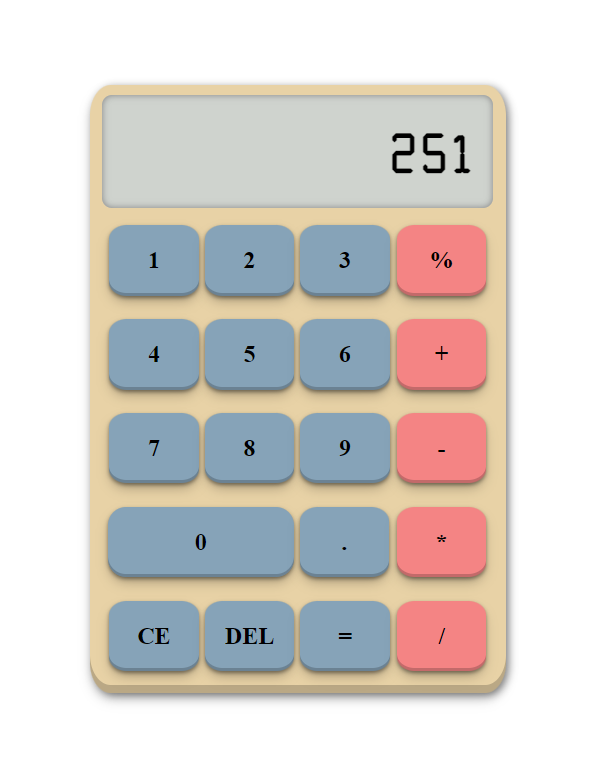

# Odin-Calculator

A simple, responsive web-based calculator with keyboard support and sound effects. The calculator performs basic arithmetic operations such as addition, subtraction, multiplication, division, and modulo. It also includes clear and delete functionalities. The design is fully responsive, adapting to different screen sizes.

## Table of Contents
1. [Features](#features)
2. [Project Structure](#project-structure)
3. [How to Use](#how-to-use)
4. [Keyboard Shortcuts](#keyboard-shortcuts)
5. [Technologies Used](#technologies-used)
6. [Screenshots](#screenshots)

## Features

- **Basic Arithmetic**: Supports addition, subtraction, multiplication, division, and modulo operations.
- **Keyboard Support**: Use the number keys, Enter for equals, Backspace for delete, and operators like `+`, `-`, `*`, `/`.
- **Sound Effects**: Click sound plays whenever a button is pressed.
- **Responsive Design**: Works on various screen sizes, including mobile devices.
- **Error Handling**: Displays "Error" for results exceeding 10 digits and "EPIC FAIL!" for division by zero.

## Project Structure

- `index.html`: Contains the structure of the calculator.
- `style.css`: Styles the calculator, making it visually appealing and responsive.
- `script.js`: Adds interactivity, handles operations, and manages the user input/output.
- `click.wav`: The audio file played when buttons are pressed.

## How to Use

  [**Live Demo**](https://vedad24.github.io/Odin-Calculator/)

1. Clone or download the repository.
2. Open `index.html` in your browser.
3. Use the on-screen buttons or your keyboard to perform calculations.

## Keyboard Shortcuts

- Numbers `0-9`: Input digits
- `+`, `-`, `*`, `/`: Perform arithmetic operations
- `Enter`: Equals
- `Backspace`: Delete last character
- `Delete`: Clear the screen
- `.`: Add decimal point

## Technologies Used

- **HTML**: For structure.
- **CSS**: For styling and layout.
- **JavaScript**: For functionality.
- **Audio**: Adds a click sound to buttons.

## Screenshots

